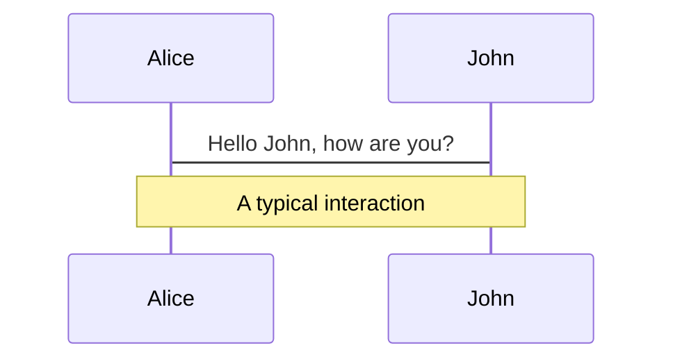
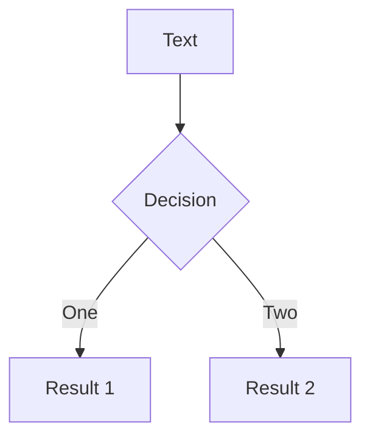
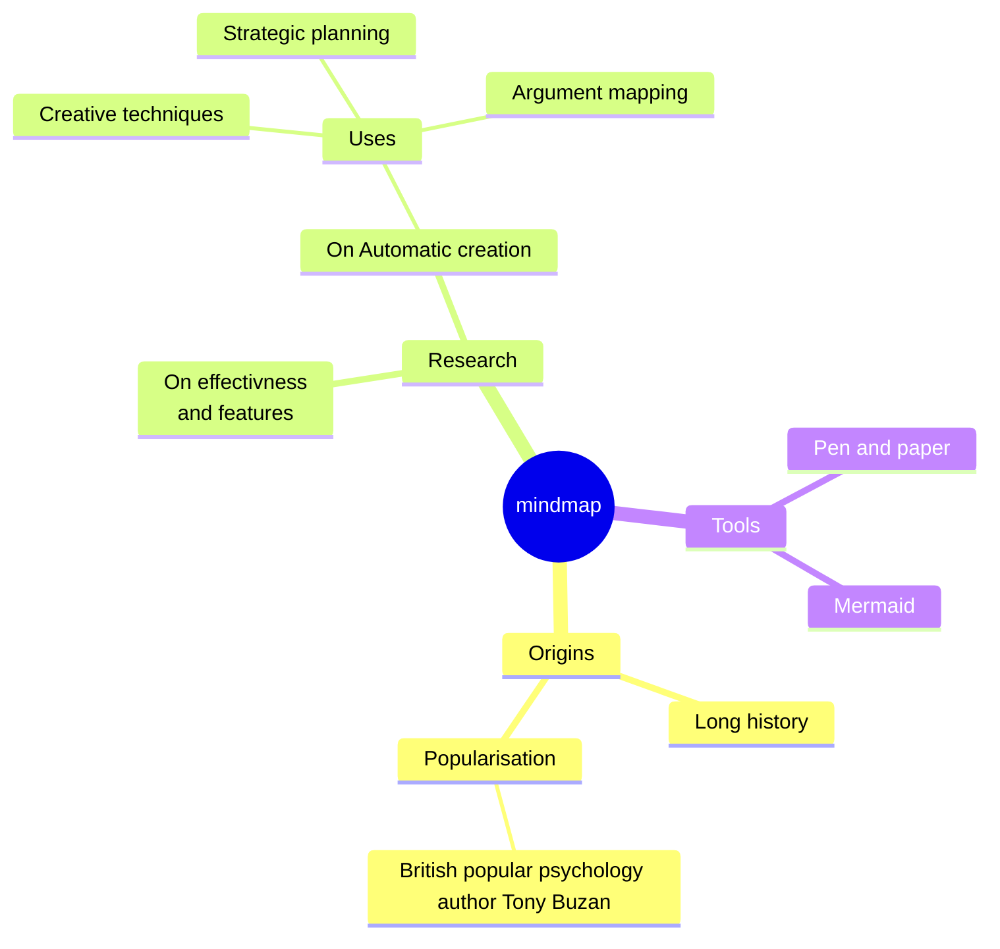
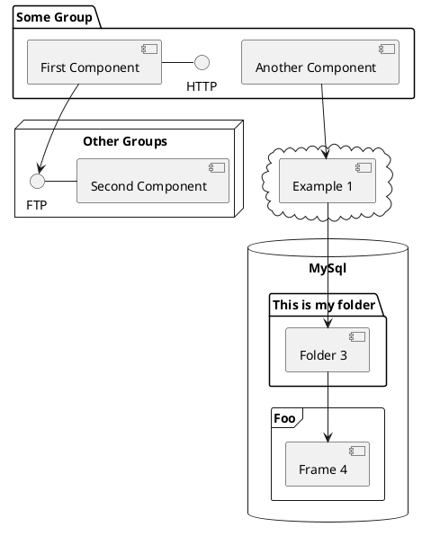

# Parallel JavaScript execution using Dedicated Web wokrers

A guide on how to elevate client side performance with Worker APIs and custom Worker managers.

Beertalk by CuddlyBunion341
@ Renuo AG

---
layout: image-right
image: https://media.istockphoto.com/id/696935130/de/foto/komplexe-mathematische-formeln-auf-whiteboard-mathematik-und-naturwissenschaften-mit.jpg?s=2048x2048&w=is&k=20&c=0gtlcarZJ7kzQhyMs5GXaqDTjeFiU3xbyjfaKxb8RiI=
---

# When should you care about parallel execution?

- Complex Mathematical Calculations
- Big data processing on the client
- Expensive network calls
- Video compression / encoding
- Real time data streaming
- Text analysis / processing

---

# My Problems and Solutions
Challanges I encountered when implementing multithreaded world generation in my [minecraft clone](https://github.com/CuddlyBunion341/tsmc2).

## Render Performance
**Problem:** Frametimes were greatly hindered while world was generating.

**Solution:** Move terrain generation to dedicated worker.

## Generation time
**Problem**: It took > 30s to generate chunks in render distance of player

**Solution:** Manage multiple worker instances in a worker pool

---
layout: image-right
image: https://images.pexels.com/photos/1872903/pexels-photo-1872903.jpeg?auto=compress&cs=tinysrgb&w=1260&h=750&dpr=2
---

# Multithreaded Dish

**Recipe Title:** Deliciously Responsive Web Soup with Dedicated Web Worker Croutons

## Serves
Web application in need of a performance boost.

## Ingredients
- At least one dedicated or shared web worker
- A pinch of JavaScript (JS) or TypeScript (TS) logic
- API endpoints or data sources, finely chopped
- Complex calculations or algorithms, to taste
<!-- - Asynchronous tasks, seasoned with Promises or async/await -->
- Optional: Transfer objects and Managers according to preference

---
transition: slide-up
layout: quote
---

# What is a Web Worker?

"Web Workers makes it possible to run a script operation in a background thread separate from the main execution thread of a web application. The advantage of this is that laborious processing can be performed in a separate thread, allowing the main (usually the UI) thread to run without being blocked/slowed down."

https://developer.mozilla.org/en-US/docs/Web/API/Web_Workers_API
---
layout: two-cols-header
---

# Difference between Workers
https://developer.mozilla.org/en-US/docs/Web/API/Web_Workers_API


::left::
## Dedicated / Shared Workers
- run in a separate execution context
- don't support direct DOM manipulation
- are used for simple background tasks
- die as soon as page is closed
- support ES modules
- don't support caching

::right::
## Service Workers
- run in a separate execution context
- don't support direct DOM manipulation
- act as a proxy between application, browser and network
- are long lived
- support ES modules
- support caching

---

# Basic example

```js
// my-worker.js

self.onmessage = (message) => {
  // perform expensive calculation on data
  postMessage(result)
}

// index.js

const worker = new Worker('my-worker.js')
worker.postMessage(message)

worker.onmessage = (message) => {
  // do something with processed data
}
```

---

# Terrain Generation Example

```ts
// Chunk.ts
class Chunk {
  ...
  prepareGeneratorWorkerData() {
    const payload = {
      chunkX: this.x,
      chunkY: this.y,
      chunkZ: this.z,
      chunkWidth: this.chunkData.width,
      chunkHeight: this.chunkData.height,
      chunkDepth: this.chunkData.depth,
      terrainGeneratorSeed: this.terrainGenerator.seed
    }

    const transferable = [this.chunkData.data.data.buffer] // not used at the moment

    const callback = (payload: { data: ArrayBuffer }) => {
      this.chunkData.data.data = new Uint8Array(payload.data)
    }

    return { payload, transferable, callback }
  }
  ...
}
```

---

<Transform :scale="0.95">

```ts
// TerrainGenerationWorker.ts
import { ChunkData } from '../ChunkData'
import { TerrainGenerator } from '../TerrainGenerator'

self.onmessage = (message: any) => {
  const { data } = message
  const { chunkX, chunkY, chunkZ, chunkWidth, chunkHeight, chunkDepth, terrainGeneratorSeed } = data

  const terrainGenerator = new TerrainGenerator(terrainGeneratorSeed)
  const chunkData = new ChunkData(chunkWidth, chunkHeight, chunkDepth)

  for (let x = -1; x < chunkWidth + 1; x++) {
    for (let y = -1; y < chunkHeight + 1; y++) {
      for (let z = -1; z < chunkDepth + 1; z++) {
        const block = terrainGenerator.getBlock(
          x + chunkX * chunkWidth,
          y + chunkY * chunkHeight,
          z + chunkZ * chunkDepth
        )
        chunkData.set(x, y, z, block)
      }
    }
  }

  const arrayBuffer = chunkData.data.data.buffer

  postMessage(arrayBuffer, [arrayBuffer])
}
```

</Transform>

---

# Potential improvements at first glance

1. Implement Chunk serialization / deserialization in Chunk class.
1. Extract Worker logic into separate class?
1. Reduce memory allocation by using existing Buffer objects.
1. Initialize Worker with world seed.


---
transition: slide-up
---

# Before / After
Note that chunk meshing is not parallelized, only terrain generation is.

<div grid="~ cols-2 gap-4">


</div>

---
layout: image-right
image: https://images.pexels.com/photos/220996/pexels-photo-220996.jpeg?auto=compress&cs=tinysrgb&w=1260&h=750&dpr=2
---

# Observation
One problem solved, one more to go.

1. Chunk generation no longer impedes rendering.
1. The loading screen is gone.
1. Terrain generation is "parallel" but could be "paralleler"
1. World generation became slower.
1. Workers are not getting utilized enough.

---
layout: image-left
image: https://images.pexels.com/photos/8783845/pexels-photo-8783845.jpeg?auto=compress&cs=tinysrgb&w=1260&h=750&dpr=2
---

# Solution

1. Implement a Worker Manager.
1. Store a list of active / inactive workers.
1. Queue tasks when no worker is available.
1. Figure out how many workers can be used at once.

---
layout: default
---

# Table of contents

<Toc maxDepth="1"></Toc>

---
transition: slide-up
level: 2
---

# Navigation

Hover on the bottom-left corner to see the navigation's controls panel, [learn more](https://sli.dev/guide/navigation.html)

## Keyboard Shortcuts

|     |     |
| --- | --- |
| <kbd>right</kbd> / <kbd>space</kbd>| next animation or slide |
| <kbd>left</kbd>  / <kbd>shift</kbd><kbd>space</kbd> | previous animation or slide |
| <kbd>up</kbd> | previous slide |
| <kbd>down</kbd> | next slide |

<!-- https://sli.dev/guide/animations.html#click-animations -->

<p v-after class="absolute bottom-23 left-45 opacity-30 transform -rotate-10">Here!</p>

---
layout: image-right
image: https://source.unsplash.com/collection/94734566/1920x1080
---

# Code

Use code snippets and get the highlighting directly![^1]

```ts {all|2|1-6|9|all}
interface User {
  id: number
  firstName: string
  lastName: string
  role: string
}

function updateUser(id: number, update: User) {
  const user = getUser(id)
  const newUser = { ...user, ...update }
  saveUser(id, newUser)
}
```

<arrow v-click="[3, 4]" x1="400" y1="420" x2="230" y2="330" color="#564" width="3" arrowSize="1" />

[^1]: [Learn More](https://sli.dev/guide/syntax.html#line-highlighting)

<style>
.footnotes-sep {
  @apply mt-20 opacity-10;
}
.footnotes {
  @apply text-sm opacity-75;
}
.footnote-backref {
  display: none;
}
</style>

---

# Components

<div grid="~ cols-2 gap-4">
<div>

You can use Vue components directly inside your slides.

We have provided a few built-in components like `<Tweet/>` and `<Youtube/>` that you can use directly. And adding your custom components is also super easy.

```html
<Counter :count="10" />
```

<!-- ./components/Counter.vue -->
<Counter :count="10" m="t-4" />

Check out [the guides](https://sli.dev/builtin/components.html) for more.

</div>
<div>

```html
<Tweet id="1390115482657726468" />
```

<Tweet id="1390115482657726468" scale="0.65" />

</div>
</div>

<!--
Presenter note with **bold**, *italic*, and ~~striked~~ text.

Also, HTML elements are valid:
<div class="flex w-full">
  <span style="flex-grow: 1;">Left content</span>
  <span>Right content</span>
</div>
-->


---
class: px-20
---

# Themes

Slidev comes with powerful theming support. Themes can provide styles, layouts, components, or even configurations for tools. Switching between themes by just **one edit** in your frontmatter:

<div grid="~ cols-2 gap-2" m="t-2">

```yaml
---
theme: default
---
```

```yaml
---
theme: seriph
---
```


</div>

Read more about [How to use a theme](https://sli.dev/themes/use.html) and
check out the [Awesome Themes Gallery](https://sli.dev/themes/gallery.html).

---
preload: false
---

# Animations

Animations are powered by [@vueuse/motion](https://motion.vueuse.org/).

```html
<div
  v-motion
  :initial="{ x: -80 }"
  :enter="{ x: 0 }">
  Slidev
</div>
```

<div class="w-60 relative mt-6">
  <div class="relative w-40 h-40">
    
    
    
  </div>

  <div
    class="text-5xl absolute top-14 left-40 text-[#2B90B6] -z-1"
    v-motion
    :initial="{ x: -80, opacity: 0}"
    :enter="{ x: 0, opacity: 1, transition: { delay: 2000, duration: 1000 } }">
    Slidev
  </div>
</div>

<!-- vue script setup scripts can be directly used in markdown, and will only affects current page -->
<script setup lang="ts">
const final = {
  x: 0,
  y: 0,
  rotate: 0,
  scale: 1,
  transition: {
    type: 'spring',
    damping: 10,
    stiffness: 20,
    mass: 2
  }
}
</script>

<div
  v-motion
  :initial="{ x:35, y: 40, opacity: 0}"
  :enter="{ y: 0, opacity: 1, transition: { delay: 3500 } }">

[Learn More](https://sli.dev/guide/animations.html#motion)

</div>

---

# LaTeX

LaTeX is supported out-of-box powered by [KaTeX](https://katex.org/).

<br>

Inline $\sqrt{3x-1}+(1+x)^2$

Block
$$ {1|3|all}
\begin{array}{c}

\nabla \times \vec{\mathbf{B}} -\, \frac1c\, \frac{\partial\vec{\mathbf{E}}}{\partial t} &
= \frac{4\pi}{c}\vec{\mathbf{j}}    \nabla \cdot \vec{\mathbf{E}} & = 4 \pi \rho \\

\nabla \times \vec{\mathbf{E}}\, +\, \frac1c\, \frac{\partial\vec{\mathbf{B}}}{\partial t} & = \vec{\mathbf{0}} \\

\nabla \cdot \vec{\mathbf{B}} & = 0

\end{array}
$$

<br>

[Learn more](https://sli.dev/guide/syntax#latex)

---

# Diagrams

You can create diagrams / graphs from textual descriptions, directly in your Markdown.

<div class="grid grid-cols-4 gap-5 pt-4 -mb-6">









</div>

[Learn More](https://sli.dev/guide/syntax.html#diagrams)

---
src: ./pages/multiple-entries.md
hide: false
---

---
layout: center
class: text-center
---

# Learn More

[Documentations](https://sli.dev) · [GitHub](https://github.com/slidevjs/slidev) · [Showcases](https://sli.dev/showcases.html)
